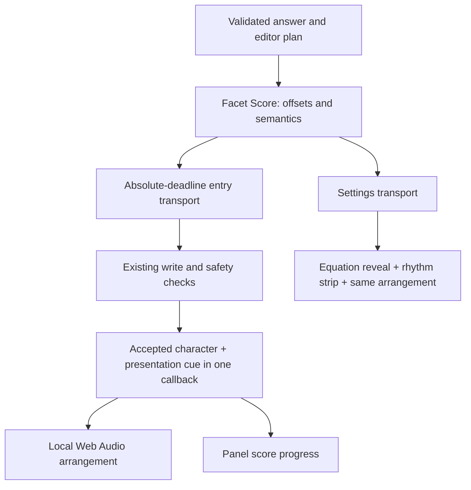

# Answer Cadence · RC5

The answer itself is a score: **Facet Score** is a deterministic timeline of
already-approved entry actions. **Answer Cadence** is the feature in Settings
and during insertion. An arrangement chooses how that score sounds.

## One conductor

`extension/common/cadence.js` owns the timing formula and semantic score.
It retains the previous bounded tempo/window blend, beat weights, swing,
variation and structural rests. Variation now uses a seed derived from the
characters, so the same answer and timing settings produce the same score.
The first note is immediate; the last offset is corrected to the resolved
length. Empty and single-character answers remain immediate.

The hard window is 2–12 seconds, with independent 30–300 BPM tempo. Those are
planned offsets, not a guarantee that a browser event loop or a slow Hawkes
editor can meet a real-time deadline. Late events run immediately against the
original origin; their lateness is never added to every subsequent note.
Settings reports measured elapsed-window compliance at resolution.

The event page builds the score once for the approved route. Plain native
inputs and contenteditable fields receive it through the isolated prelude.
Structured `enterPlan()` receives the same score as serialized data: it no
longer contains a second copy of the rhythm algorithm. The build gate prevents
that copy from returning. Multi-field plain answers consume successive segments
of one score and one origin, rather than starting a new duration window in each
box. Structured multi-field entry already used one clock and continues to do so.

Template preparation, slot selection and settling retain their existing editor
mechanics. They consume the same performance clock, without adding independent
musical delays. The next character carries the template's musical context:
there is no speculative note for a template the editor might refuse. Settings
shows template/slot telemetry on that upcoming note's offset, as before.

After the writer's existing checks accept a character, that same callback emits
its index and elapsed time. It does not start a separately timed soundtrack or
queue the rest of the music. In Settings, the same callback reveals a character
and strikes its voice. The continuously moving playhead reads the transport's
exact origin with animation frames; it does not conduct notes.

## Arrangements and mathematical roles

Genre changes **no timestamp**, tempo, swing, weight or duration. Explicit score
timing controls remain available for every genre. An upgraded profile is read
with the active legacy preset's timing intact; Apply stores those independent
values and a migration marker atomically. Settings remains a draft until Apply.

| Arrangement | Sound |
| --- | --- |
| Classical | Triangle/sine chamber plucks, open fifths, major pentatonic melody, warm closing triad. |
| Jazz | Electric-key partials, minor sevenths and ninths, a minor pentatonic melody. No extra swing clock. |
| Lo-fi | Lower felt-key voicings, mellow moving low-pass filter, longer release, suspended harmony. |
| Electronic | Bright glass harmonics, a slightly detuned upper partial, compact note releases and accented bass. |
| Custom | Select chamber pluck, felt keys or glass harmonics over the Classical harmonic palette. Timing remains independently editable. |

Numbers map to scale degrees; repeated variables keep a stable pitch identity.
Operators turn the harmony, exponents move up an octave, fraction denominators
move down, and radicals add a quiet upper harmonic. Parentheses use a framing
fifth; separators have short low notes; whitespace is silent. Structural rests
let existing voices decay. Accents can add a quiet bass foundation. The final
character carries a resolving chord at its own timestamp, followed by a short
release (up to 1.37 seconds), not an additional scheduled note.

`common/cadence-audio.js` contains a pure `arrangeNote()` mapping and the
`CadenceInstrument` renderer. Its oscillators and gain/filter envelopes are a
small procedural sound vocabulary. No samples, external assets, runtime,
model, streaming service, native host, network request or new permission is
needed for playback.

## Firefox lifecycle

The Settings instrument lives in the Settings document. Preview calls
`AudioContext.resume()` inside the real user click, with a bounded 200 ms device
warm-up before establishing the score origin. A denied/pending resume cannot
hang the preview. Stop/restart kills old voices; pagehide closes the context;
normal completion suspends the device after the final envelope finishes.
Volume and mute affect the current preview immediately; Apply saves them for
insertion. Music during insertion is opt-in and defaults off.

Insertion sound lives in Firefox's **event page**, not the toolbar popup.
The panel obtains its background-window reference ahead of time and calls its
narrow audio-unlock function synchronously in the actual Insert gesture,
before asynchronous preparation. Firefox 155 measured the popup click as trusted
and activated, but the background document itself was not activated. Its default
extension-background autoplay exemption allowed playback. Pending device resume
accepts the first event's voice without delaying insertion; denied playback is
discarded on completion. Audio refusal never changes an insertion result.

A short-lived isolated-world observer opens a runtime port for the performance.
An open port alone does **not** keep an MV3 event page alive. Firefox's ordinary
idle timeout is 30 seconds, beyond this feature's 2–12 second score and short
release; real presentation cues are activity, with no artificial keepalive
traffic. Popup destruction does not destroy the background instrument. The
sidebar is optional. Event-page suspension closes audio and presentations;
contexts are recreated on a later Insert, never resumed mid-answer. This is a
bounded default-policy lifetime, not a promise of playback through event-page
termination or a browser with an aggressively shortened idle timeout.

`common/cadence-session.js` accepts cues only for a registered run, the pinned
tab/frame, the next expected index, and a bounded elapsed value. It forwards
sound and panel telemetry immediately. There is no look-ahead audio queue:
IPC and the output device add latency, but there is no second musical clock to
drift. A successful write allows up to 250 ms for its already-emitted final cue
to drain across Firefox's separate IPC channels. No insertion waits for this.

Observer setup is optional and bounded to 250 ms. Failure proceeds to the
approved write with sound unavailable, after another ownership check. Completion,
failure, port disconnect, navigation and a 20-second fallback resource lease
remove the listener and port. These setup/cleanup deadlines never schedule notes.
At most 24 voices (up to 96 oscillators) can be active; late bursts cannot grow
unbounded audio work. Envelopes disconnect their nodes after completion.

Mozilla references: [autoplay and Web Audio](https://developer.mozilla.org/en-US/docs/Web/Media/Guides/Autoplay),
[popup teardown](https://developer.mozilla.org/en-US/docs/Mozilla/Add-ons/WebExtensions/user_interface/Popups),
[sidebar lifetime](https://developer.mozilla.org/en-US/docs/Mozilla/Add-ons/WebExtensions/user_interface/Sidebars),
[event pages and open ports](https://developer.mozilla.org/en-US/docs/Mozilla/Add-ons/WebExtensions/Background_scripts),
[user gestures and async boundaries](https://developer.mozilla.org/en-US/docs/Mozilla/Add-ons/WebExtensions/User_actions).

## Safety and page observability

Solving, selecting a target, validating representation and planning structure
remain outside Cadence. Hawkes ownership, stale-target and selection checks,
structured rollback, graph actuation and never-submit behavior remain in their
existing paths. Graph operations do not acquire a musical score.

The active writer emits a transient DOM CustomEvent with a per-performance
channel name and a string containing only note index and elapsed time. This
works across Firefox's MAIN/isolated boundary without page globals, injected
nodes, prototype modification or extension resource URLs. **Page code can
observe or forge this presentation cue.** It is not authentication or an input
command: no received cue can write, select, solve, navigate or submit anything.
Nothing trusts a page event to advance insertion.

The observer removes its listener after the operation. No answer, score or
musical event is saved to storage or diagnostics. Only preferences and the
existing redacted diagnostics persist. “Zero footprint” means no persistent
extension-created page UI/state, not undetectability. Synthetic input and
MAIN-world editor calls remain observable.

## Sound architecture decision

Pure Web Audio synthesis earns this slice: negligible asset footprint,
immediate procedural voices, deterministic mappings, and no decoding or sample
cache to warm. Tiny bundled instrument samples could improve piano/pluck realism
but add licensing, package bytes, decode memory and extra lifecycle state. A
hybrid is a reasonable next step only if a small listening comparison shows a
clear benefit. Streaming and runtime-generated waveforms from a model do not
belong in normal playback.

The musical boundary is deliberately narrow: an arranger chooses pitches,
voicing, timbre, gain and decay for an existing score note. It cannot change
offsets, call the editor or invoke the conductor.

## HX370 / XDNA and Facet

Read-only inspection on 5 September 2026 found an HX370, XRT 2.21.75, amdxdna,
NPU Strix at `0000:c5:00.1`, and firmware 1.1.2.64. FastFlowLM lists installed
`gpt-oss:20b`, `llama3.2:1b`, `qwen3:0.6b`, `qwen3.5:4b` and `qwen3.5:9b`.
No model was loaded for Cadence work.

Facet's sibling runtime currently assigns `gpt-oss:20b` to NPU text: its checked-in
measurements cite 18.7 decode tokens/second and a 14 GiB artifact. Its remote
protocol supports text generation and math solving, not audio arrangement.
That is excessive cost for a 2–12 second deterministic phrase whose voicings
are already inexpensive and predictable.

A worthwhile future experiment is an **offline, pre-performance arranger**:
feed a compact structural descriptor (counts, nesting, phrase shape) into Facet,
ask it for a motif or bounded instrument/voicing choice, validate a closed JSON
schema, then cache that arrangement by score version and structural hash. A
human can audition it before use. The browser accepts only bounded musical
parameters, never model-provided timestamps, executable code or editor actions.
Rejection, absence or cancellation keeps the bundled arrangement. Normal
playback remains entirely model-free.

Sample classification only earns an NPU once there is a meaningful sample
library to classify. RC5 has none. Motif selection from this tiny vocabulary is
cheaper as a deterministic mapping. No NPU integration is shipped merely to put
an accelerator badge beside the feature.

Hardware/runtime sources: [AMD HX370](https://www.amd.com/en/products/processors/laptop/ryzen/ai-300-series/amd-ryzen-ai-9-hx-370.html),
[FastFlowLM](https://github.com/FastFlowLM/FastFlowLM),
[Linux support](https://fastflowlm.com/docs/install_lin/), plus
`../facet-runtime/src/facet_runtime/models.py` and `remote.py` inspected locally.

## Verification and demo

`tests/test_cadence_score.py` executes the score and real MAIN writer under a
virtual clock. It checks identical write/sound/view timestamps across all five
genres and every 2–12 second duration, deterministic replay, mathematical roles,
absolute timing under event-loop delay, refused writes, throwing/pending audio,
and legacy profile migration. Existing Hawkes safety tests remain required.

`scripts/run_settings_smoke.py` drives the actual Settings controls, draft/apply,
score, restart, Stop and reduced-motion behavior in isolated Firefox.
`scripts/run_cadence_audio_smoke.py` measures actual Web Audio PCM, all five
arrangements, mute, cancellation and device suspension, then exercises the
real panel Insert and entry routes against disposable localhost fixtures.
The fixture substitutes only its origin and a deterministic solver result;
its evidence is not a claim of signed-addon verification in a coursework profile.

For a demo, start with the structured Settings equation, choose a 6–8 second
window, play Classical and then Jazz without moving a score mark. Point out the
exponent lift, denominator register and final chord. Apply optional insertion
music and place an already-reviewed answer from the toolbar; closing the popup
must not end the phrase. The sidebar can display progress throughout.
