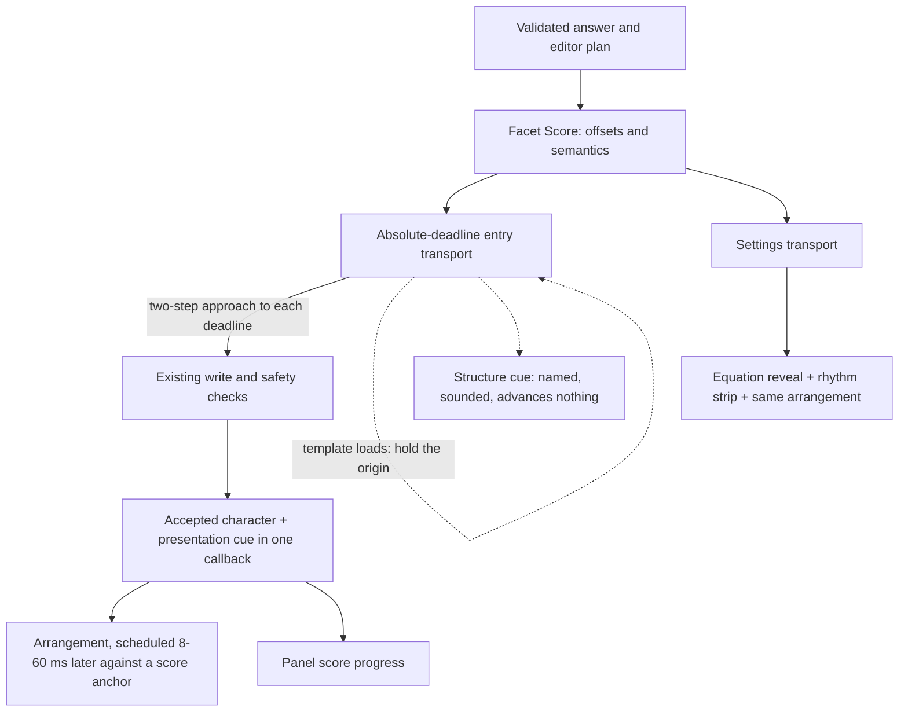

# Answer Cadence · RC5

The answer itself is a score: **Facet Score** is a deterministic timeline of
already-approved entry actions. **Answer Cadence** is the feature in Settings
and during insertion. An arrangement chooses how that score sounds.

## One conductor

`extension/common/cadence.js` owns the timing formula and semantic score.
It retains the bounded tempo/window blend, beat weights, swing, variation and
structural rests. Variation uses a seed derived from the characters, so the same
answer and timing settings produce the same score. The first note is immediate;
the last offset is corrected to the resolved length. Empty and single-character
answers remain immediate.

The hard window is 2–12 seconds, with independent 30–300 BPM tempo. Those are
planned offsets, not a guarantee that a browser event loop or a slow Hawkes
editor can meet a real-time deadline. Late events run immediately against the
original origin; their lateness is never added to every subsequent note.
Settings reports measured elapsed-window compliance at resolution.

Each note also carries what an arrangement needs to read it: its accent, the
rest that follows it, its position in the beat shape, its nesting depth, and the
harmonic region it falls in. The region advances at every operator, so **the
expression's own grammar is the harmonic rhythm**. Orchestration reads all of
this and writes none of it.

The event page builds the score once for the approved route, whichever route
that is. `enterPlan()` — the page-world writer, which places every answer into
a single Hawkes answer box of either kind — receives it as serialized data: it
no longer contains a second copy of the rhythm algorithm, and the build gate
prevents that copy from returning. Separate plain solution fields and
contenteditable fields receive it through the isolated prelude. Multi-field
plain answers consume successive segments of one score and one origin, rather
than starting a new duration window in each box. Structured multi-field entry
already used one clock and continues to do so.

Which writer runs is not a Cadence decision and never was: `common/transport.js`
makes it from the page's own answer model, before a score exists. What changed
is that a dynamic editor's *characters* now go through that editor's own
`keyPadButtonClick` rather than being assigned into its box — one note per
character, on the same offsets, through one `runScoredEntry`. A template
remains a fermata and a character remains a note; nothing here acquired a
second clock, and `tests/test_cadence_score.py` executes both transports
against the same score to say so.

### Structure is a fermata, not a burst

Loading a template is real editor work of a length only the editor knows:
`press` waits for the editor's own guard, then `settle` waits for its boxes to
stop appearing. The score never allotted time for that. Leaving the origin where
it was made every remaining note overdue the instant the structure appeared, so
the rest of the answer arrived in one burst and the music with it.

The transport moves its origin instead. The phrase is *held* for exactly the
overrun, the note after it is due at once, and every note after that keeps the
spacing the score gave it. Wall-clock length is then the score's duration plus
the measured hold, which is honest: the editor really did take that long. The
writer reports `heldMs` alongside its per-note lateness, the panel names the
structure while it is being built, and the instrument sounds a low, wide frame
at the moment it lands. Multi-field plain answers hold the same way between
fields. Nothing about this changes what is typed, only when the *next* thing is.

There is still no speculative note for a template the editor might refuse: the
frame is sounded after the boxes exist. Settings shows template/slot telemetry
on the upcoming note's offset, as before.

### Two clocks that cannot separate

A long `setTimeout` is coalesced with whatever else its process has pending. A
four-second gap between notes was measured waking 343 ms late in real Firefox —
audible, and the largest single defect in the previous build. Both transports
now approach each deadline in two steps: wait until roughly 200 ms remain, then
re-arm. A nearly-due timer is fired promptly, and because every wait is still
computed from the same absolute origin the approach cannot overshoot and no
lateness is carried forward.

The instrument then places each voice against an anchor derived from the same
offsets. The first note of a performance anchors 30 ms ahead; each later note is
placed at that anchor plus its own score offset, clamped to between 8 ms and
60 ms after the write that caused it. A write that arrives a little early is held
to the time the score gave it — which is what removes the browser's remaining
jitter from the rhythm. A write that arrives genuinely late cannot be played in
the past: it starts as soon as it may, and the anchor moves with it, so one late
wake-up costs one late note rather than a correction the rest of the phrase has
to fight. A fermata drops the anchor entirely, and the next note re-establishes
it in tempo.

This is not a second tempo system. There is one score; the anchor is derived
from it, holds only within a window narrower than audio-visual simultaneity, and
exists only because an accepted write called for it.

After the writer's existing checks accept a character, that same callback emits
its index and elapsed time. It does not start a separately timed soundtrack or
queue the rest of the music. In Settings, the same callback reveals a character
and strikes its voice. The continuously moving playhead reads the transport's
exact origin with animation frames; it does not conduct notes.

## Arrangements and mathematical roles

Genre changes **no timestamp**, tempo, swing, weight or duration. Explicit score
timing controls remain available for every genre. An upgraded profile is read
with the active legacy preset's timing intact; Apply stores those independent
values and a migration marker atomically. Settings remains a draft until Apply.

An arrangement is not a waveform. Each is a mode, a set of chord voicings, a
register plan, an instrument, an envelope, a percussion pattern and a way of
ending — five readings of one score, in the sense a lead sheet has readings.

| Arrangement | Key and mode | Harmony | Instrument and envelope | Percussion | Ending |
| --- | --- | --- | --- | --- | --- |
| Classical | C, Ionian | Close triads, I–IV–V–I, rolled 16 ms | Triangle chamber pluck, 4 ms attack, quick upper partials | none; accents get a low pizzicato | Authentic cadence, V→I with the octave doubled |
| Jazz | C, Dorian | Rootless 3–7–9 voicings, ii–V–I–vi, rolled 8 ms | Electric keys: sine under a bell-like 4.02 partial, 9 ms attack | Brushed ride between accents, rim shot on them | ii–V–I onto a major ninth |
| Lo-fi | A, Aeolian | Wide minor ninths, i–♭VII–♭VI–i, rolled 26 ms | Felt keys: 30 ms attack, 1.3 s release, filter closed to 1450 Hz | Soft kick on the beat, closed hat off it | Plagal fall with a long tail |
| Electronic | C, Aeolian | Stacked fifths and octaves, i–♭VI–♭III–♭VII, no roll | Resonant detuned saw lead; glass harmonics for variables; 2 ms attack | Sub kick on the beat, tight hats off it | Octave-and-fifth, compact |
| Custom | Classical's | Classical's | Chamber pluck, felt keys or glass, as chosen | none | Classical's |

Jazz and Lo-fi place their *accompaniment* 20 ms and 26 ms behind the beat. The
character's own voice never moves: `layers[0]` always carries the exact score
offset, and only chord, bass and percussion carry `feelMs`, which is bounded at
30 ms. That is how a genre gets a feel without an answer getting a second clock.

Mathematics chooses the notes. A digit takes the scale degree of its own value;
a letter takes a stable identity, so `x` is the same pitch everywhere in one
answer. An operator states the root of the chord it turns to. Exponents lift an
octave and open the filter; a fraction denominator drops one and closes it;
nesting depth narrows toward the middle. Parentheses are a framing fifth,
spreading down when they open and resolving up when they close. Separators are
short and low. Whitespace is silent. Radicals add an upper partial. A template
landing is its own low, wide frame — an exponent's opens above the phrase, a
fraction's below it. The final character carries the arrangement's own cadence
chord at its own timestamp, followed by its natural release, not an extra note.

`common/cadence-audio.js` contains the pure `arrangeNote()` and
`arrangeStructure()` mappings and the `CadenceInstrument` renderer. Its
oscillators, one shared half-second noise buffer, and gain/filter envelopes are
the whole sound vocabulary. No samples, external assets, runtime, model,
streaming service, native host, network request or new permission is needed for
playback. `scripts/render_cadence_audio.py` renders all five through the shipped
renderer to WAV, so they can be listened to and compared rather than described.

## Firefox lifecycle

The two instruments have deliberately different idle policies, and the
difference is the whole of what went wrong before.

The Settings instrument lives in the Settings document, where Preview is a real
click: it may suspend its device when a phrase finishes and resume it on the
next Preview, because the activation to do that exists. One device serves the
whole Settings session; Stop releases the voices and suspends, restart resumes,
and only `pagehide` closes it. Repeated previews therefore open no new devices.

The insertion instrument lives in Firefox's **event page**, which has no user
activation of its own. Firefox admits a *newly created* `AudioContext` there
under its extension-background autoplay exemption — but a `resume()` on a device
that page suspended has nothing to draw on, and was measured staying suspended.
The second answer of a session then played into a stopped device. So this
instrument **closes when idle** and opens a fresh device for each performance,
which is the path that is known to start. Opening one was measured at 0 ms to
create and 2–9 ms to running, inside the observer's own 250 ms setup budget, and
twenty open/close cycles grew resident memory by 2.3 MB.

Two things ask for that device, and either is enough. The panel holds a
background-page reference obtained ahead of time and calls a narrow unlock
function synchronously inside the real Insert gesture. The event page also
unlocks for itself at the start of a scored entry — which matters, because the
panel's reference is best-effort: a popup that has not resolved it yet, or one
destroyed mid-answer, would otherwise leave the answer silent. Audio refusal
never changes an insertion result.

Volume and mute affect the current preview immediately; Apply saves them for
insertion. Music during insertion is opt-in and defaults off; the preference is
`entryMusicEnabled`, stored like every other, and an upgraded profile that has
never seen it reads the default rather than acquiring sound by surprise.

A short-lived isolated-world observer opens a runtime port for the performance.
RC5 does not rely on how long the event page then lives, and the previous claim
that an open port is not a keepalive did not survive measurement: with a silent
port and a sixty-second oscillator scheduled, a default-policy Firefox 155 event
page was still the same document a minute later. After that minute the feature
was holding no voice, and `runtime.onSuspend` releases every presentation and
closes the device whenever Firefox does say so.

*Whether* it says so is Firefox's, and it varies: the same probe has seen an
announced suspension that was then not carried out and, on 2026-09-08, no
announcement at all. So the smoke exercises the release rather than waiting for
it — it idles for a minute, requires that no voice is held, then calls the exact
listener that announcement is given, which must leave no voice and no device.
Requiring the device to be gone *without* asking measured whether some earlier
operation's `finish` happened to land inside the idle window, which is a fact
about scheduling and not about this feature.

Real presentation cues are activity; nothing here sends keepalive traffic. Popup
destruction does not destroy the background instrument, and the sidebar is
optional. A device is opened per performance and never resumed mid-answer. This
is a bounded, resource-releasing lifetime rather than a promise about Firefox's
idle timeout, which is Firefox's to change.

`common/cadence-session.js` accepts cues only for a registered run, the pinned
tab/frame, the next expected index, and a bounded elapsed value. A four-part cue
is a template landing: it is bounded the same way, must name a structure of at
most 32 characters, and cannot advance the note counter or add a note the score
does not contain. Sound and panel telemetry are forwarded immediately. A
successful write allows up to 250 ms for its already-emitted final cue to drain
across Firefox's separate IPC channels. No insertion waits for this.

Navigating away, closing the tab, moving it between windows, closing its window
and cancelling all end a performance. The observer's own `pagehide` closes its
port, which releases the presentation, stops every voice and closes the device;
the event page also cancels explicitly at each of those points rather than
relying on the port alone. Each release records what it measured — per-note
lateness, drift, structural hold, and the instrument's own scheduling — and the
event page logs those numbers, and only those numbers, as `cadence-performed`.

Observer setup is optional and bounded to 250 ms. Failure proceeds to the
approved write with sound unavailable, after another ownership check. Completion,
failure, port disconnect, navigation and a 20-second fallback resource lease
remove the listener and port. These setup/cleanup deadlines never schedule notes.
At most 24 voices (up to 96 oscillators) can be active; late bursts cannot grow
unbounded audio work. Envelopes disconnect their nodes after completion.

Mozilla references: [autoplay and Web Audio](https://developer.mozilla.org/en-US/docs/Web/Media/Guides/Autoplay),
[popup teardown](https://developer.mozilla.org/en-US/docs/Mozilla/Add-ons/WebExtensions/user_interface/Popups),
[sidebar lifetime](https://developer.mozilla.org/en-US/docs/Mozilla/Add-ons/WebExtensions/user_interface/Sidebars),
[event pages and open ports](https://developer.mozilla.org/en-US/docs/Mozilla/Add-ons/WebExtensions/Background_scripts),
[user gestures and async boundaries](https://developer.mozilla.org/en-US/docs/Mozilla/Add-ons/WebExtensions/User_actions).

## Safety and page observability

Solving, selecting a target, validating representation and planning structure
remain outside Cadence. Hawkes ownership, stale-target and selection checks,
structured rollback, graph actuation and never-submit behavior remain in their
existing paths. Graph operations do not acquire a musical score.

The active writer emits a transient DOM CustomEvent with a per-performance
channel name and a string containing only note index and elapsed time. It emits
it after the write is accepted, which for a dynamic editor means after the
editor's own keypad call has put the character in the box the plan meant. This
works across Firefox's MAIN/isolated boundary without page globals, injected
nodes, prototype modification or extension resource URLs. **Page code can
observe or forge this presentation cue.** It is not authentication or an input
command: no received cue can write, select, solve, navigate or submit anything.
Nothing trusts a page event to advance insertion.

The observer removes its listener after the operation. No answer, score or
musical event is saved to storage or diagnostics. Only preferences and the
existing redacted diagnostics persist. “Zero footprint” means no persistent
extension-created page UI/state, not undetectability. Synthetic input and
MAIN-world editor calls remain observable.

## Sound architecture decision

Pure Web Audio synthesis earns this slice: negligible asset footprint,
immediate procedural voices, deterministic mappings, and no decoding or sample
cache to warm. Tiny bundled instrument samples could improve piano/pluck realism
but add licensing, package bytes, decode memory and extra lifecycle state. A
hybrid is a reasonable next step only if a small listening comparison shows a
clear benefit. Streaming and runtime-generated waveforms from a model do not
belong in normal playback.

The musical boundary is deliberately narrow: an arranger chooses pitches,
voicing, timbre, gain and decay for an existing score note. It cannot change
offsets, call the editor or invoke the conductor.

## HX370 / XDNA and Facet

Read-only inspection on 5 September 2026 found an HX370, XRT 2.21.75, amdxdna,
NPU Strix at `0000:c5:00.1`, and firmware 1.1.2.64. FastFlowLM lists installed
`gpt-oss:20b`, `llama3.2:1b`, `qwen3:0.6b`, `qwen3.5:4b` and `qwen3.5:9b`.
No model was loaded for Cadence work.

Facet's sibling runtime currently assigns `gpt-oss:20b` to NPU text: its checked-in
measurements cite 18.7 decode tokens/second and a 14 GiB artifact. Its remote
protocol supports text generation and math solving, not audio arrangement.
That is excessive cost for a 2–12 second deterministic phrase whose voicings
are already inexpensive and predictable.

A worthwhile future experiment is an **offline, pre-performance arranger**:
feed a compact structural descriptor (counts, nesting, phrase shape) into Facet,
ask it for a motif or bounded instrument/voicing choice, validate a closed JSON
schema, then cache that arrangement by score version and structural hash. A
human can audition it before use. The browser accepts only bounded musical
parameters, never model-provided timestamps, executable code or editor actions.
Rejection, absence or cancellation keeps the bundled arrangement. Normal
playback remains entirely model-free.

Sample classification only earns an NPU once there is a meaningful sample
library to classify. RC5 has none. Motif selection from this tiny vocabulary is
cheaper as a deterministic mapping. No NPU integration is shipped merely to put
an accelerator badge beside the feature.

RC5's arrangements make that conclusion stronger rather than weaker. Harmony,
voicing, register and cadence are now decided by the expression's own structure
— which operators it has, where they fall, how deeply it nests — and a lookup
table does that repeatably in 0.03 ms. A model would have to be prompted,
validated, cached and audited to arrive at something a reader can no longer
predict from the answer. The performance stays deterministic and
model-independent, which is the property this feature is actually built on.

Hardware/runtime sources: [AMD HX370](https://www.amd.com/en/products/processors/laptop/ryzen/ai-300-series/amd-ryzen-ai-9-hx-370.html),
[FastFlowLM](https://github.com/FastFlowLM/FastFlowLM),
[Linux support](https://fastflowlm.com/docs/install_lin/), plus
`../facet-runtime/src/facet_runtime/models.py` and `remote.py` inspected locally.

## What it costs, measured

`scripts/run_cadence_audio_smoke.py --case performance` enters the same
twelve-second answer six times in one browser, alternating `entryMusicEnabled`,
and reads CPU and resident memory for the whole Firefox process tree from
`/proc`. Everything except the music is in both arms and cancels.

| | Measured |
| --- | --- |
| CPU, twelve-second answer, music on | 1.480 core-seconds (mean of three) |
| CPU, same answer, music off | 1.487 core-seconds (mean of three) |
| Difference | −0.007 s: inside the ±0.5 s spread of Firefox's own work |
| Arranging and voicing one note | 0.031–0.038 ms, by arrangement |
| Opening an output device | 0 ms to create, 2–9 ms to running |
| Twenty open/close device cycles | +2.3 MB resident, after a forced collection |
| Package | +11.1 KB in the built XPI (146.6 KB → 157.7 KB) |
| Concurrent voices | 24, hard ceiling; one shared 88 KB noise buffer per device |

The three source files total 47 KB unminified. There are no samples, no assets,
and nothing to decode.

Timing, measured in real Firefox against localhost fixtures, per accepted write:

| | 2 s answer | 6 s answer | 12 s answer |
| --- | --- | --- | --- |
| Write lateness against its own score offset | 0–5 ms | 0–5 ms | 0–1 ms |
| Drift, first note to last | 1–4 ms | 5 ms | 0–1 ms |
| Voice scheduled after its character | 14–32 ms | 30–40 ms | 27–32 ms |
| Cue delivery, write to event page | 0–3 ms | 0–3 ms | 0–5 ms |
| Device output latency, constant | 31–35 ms | 31–35 ms | 31–35 ms |

Before the two-step deadline approach, the same twelve-second answer produced
single wake-ups 343 ms late. The device's own output latency is constant and
therefore inaudible as rhythm; it is reported because it is real.

### On the real editor

Measured on 6 September 2026 in the owner's own Firefox, on their own account,
against `learn.hawkeslearning.com` lesson 3.3, with insertion music on. Fifteen
answers were entered: ten into one box through the editor's templates, four
across two boxes, and one plain answer typed straight into a native field. These
are the `cadence-performed` entries the event page logs for itself. Numbers only:
no character, note or answer is recorded.

| | Across fifteen real answers |
| --- | --- |
| Notes per answer | 2–10 |
| Write lateness against its own score offset | 1–11 ms |
| Drift, first note to last | −4 to +5 ms |
| Voice scheduled after its character | 8–38 ms |
| Re-anchors per phrase | 0 or 1 |
| Structural hold | 0 ms, or 244–251 ms where a template loaded |
| Device output latency | 20–61 ms, constant within a performance |

The writer reports its own view separately, and it agrees: 0–5 ms of lateness,
0–1 ms of drift, and the same 244 and 249 ms holds the audio side measured
independently.

Those ~250 ms holds are `settle` waiting out the editor's own boxes after a
template: three quiet 60 ms polls plus the one that saw the change. The score
had not allotted that time, so the phrase held for it and resumed in tempo, and
drift across the hold stayed inside the same few milliseconds as without one.

The contenteditable writer was not reached live — no answer in that lesson takes
it — and is covered by the browser harness against localhost fixtures.

## Verification and demo

`tests/test_cadence_score.py` executes the score, the real MAIN writer and the
real instrument under a virtual clock and a virtual audio device. It checks
identical write/sound/view timestamps across all five genres and every 2–12
second duration, deterministic replay, mathematical roles, harmonic movement
following the expression's operators, a variable keeping one pitch, the four
arrangements differing in harmony, percussion, envelope and feel while sharing
every offset, absolute timing under event-loop delay, the structural fermata
against a slow editor, the audio anchor absorbing jitter and re-anchoring once
on a stall, the background instrument reopening rather than resuming its device,
refused writes, forged structure cues, throwing/pending audio, and legacy profile
migration. Existing Hawkes safety tests remain required.

`scripts/run_settings_smoke.py` drives the actual Settings controls, draft/apply,
score, restart, Stop and reduced-motion behavior in isolated Firefox.
`scripts/run_cadence_audio_smoke.py` measures actual Web Audio PCM, all five
arrangements, mute, cancellation, one device across repeated previews, and
device teardown; then exercises the real panel Insert and entry routes against
disposable localhost fixtures: four performances of 2, 6, 12 and 2 seconds
across the native, contenteditable and structured writers, popup destruction
taken at a point where the phrase has demonstrably begun, navigation mid-phrase,
the docked sidebar with its host permission granted the way a user grants it,
closing and reopening it, the add-on's own diagnostic log, and the idle
event-page lifetime. Every close of the output device is traced to its caller,
because a close nobody asked for would be the same call that silences an answer.
`--case performance` measures the table above. `scripts/render_cadence_audio.py`
renders the five arrangements to WAV through the shipped renderer.
The fixture substitutes only its origin and a deterministic solver result;
its evidence is not a claim of signed-addon verification in a coursework profile.

For a demo, start with the structured Settings equation, choose a 6–8 second
window, play Classical and then Jazz without moving a score mark. Point out the
exponent lift, denominator register and final chord. Apply optional insertion
music and place an already-reviewed answer from the toolbar; closing the popup
must not end the phrase. The sidebar can display progress throughout.
